KEY:

0	Engine

1	Engine\_MapCreate

2	Engine\_Dungeon

i	Engine\_Info

d	Display

m	Map

o	Others

Progress: <b>*Note that the number of days in brackets (e.g. 1st  Day) is counted by the number of days when something is changed. Not the actual number of days after the start of the development of the game.</b>

`	`–––––––  **Alpha Phase I  –––––––**

` `\* Unknown:	0	Camera class

` `\* 19/01/2020 (1):	0	Opening Page

` `\* 22/01/2020 (2):	1	Opening Page, Display Map

` `\* 23/01/2020 (3):	0	void function choosing()

` `\* 24/01/2020 (4):	1	Allow Choose and Load Map, Set Map Specifications When Start

` `\* 25/01/2020 (5):	1	Allow Modify Content of Map, Allow Saving and Reading of Maps, Bug Fixes

` `\* 	Bug Fixes: 

` `\*		Flat Map R/W Data into temp.mp now actually saves as Flat MapType.

` `\* 		Now tiles that without associated texture in the Tile Choosing Column cannot be chosen.

` `\* 		Reading of maps now can actually accept the Flat MapType.

` `\* 		Saving Files Modified

` `\* 29/01/2020 (6):	0	Simplifies printSprite function, Modifies related code, Added colour blending scheme to items

` `\* 31/01/2020 (7): 	0	Texture and Animation: Items.class finished, Texture file (.tx) readable by Items.class

` `\* Unknown   (8):	0	CROs.class, Tile.class finished and modified

` `\* 08/02/2020 (9):	2	Starts editing Engine\_Dungeon; Cannot run yet: waiting for texture.tx

` `\* 10/02/2020 (10):	1	Changes the printing system to print Tile class objects, Allows magnification of map

` `\* 11/02/2020 (11):	1	Allow moving the map if the map region exceeded the display region, 

` `\*		d	Bug Fixes:

` `\*				Now there will not be white undrawn region in the displayed map.

` `\* 				Selecting of tile error, display of selection of tile error

––––↑ Version 0.1.0 Moving Camera Update ↑––––

` `\* 12/02/2020 (12):	0	Special Tiles Type would change how they look depending on neibouring tiles

` `\* 13/02/2020 (13):	0	Bug fixes

` `\* 			Bug Fixes:

` `\* 				Display Error on Tile connection (1) fixed

` `\* 17/02/2020 (14):	0	Bug Fixes:

` `\* 			All display error on tile connection fixed

` `\* 18/02/2020 (15):	0	Bush tile connection (DirType Quadraconnect) done

` `\* 19/02/2020 (16):	0	Pond tile connection (DirType QuadraOverlaid) done

` `\* 		1	Bug Fixes

` `\* 		Bug Fixes:	

` `\*			Leveled Map can now also enjoy the updates of tile connections.

` `\* 22/02/2020 (17):	2	Implemented the same drawing system as MapCreate in PixelDungoen.

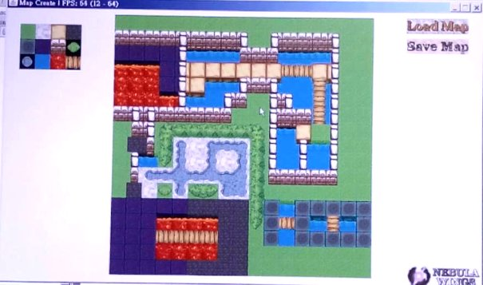

––––↑Version 0.2.0 Tile Connection Update ↑––––

` `\* 23/02/2020 (18):	2	Done control system, animations (front, side and back walk) and coarse turning

` `––––↑ Version 0.3.0 Player Control Update ↑––––

` `\* 24/02/2020 (19):	0	Added drawString function: allow different alignment and set another font for Chinese characters

` `\* 		1	Repositioning

` `\* 26/02/2020 (20):	1	Added Left Tool Bar (LTB), Enabled LTB Tiles and Items Tab, Done Items Layer

` `\* 		2	Done pick item system, Left Tool Bar

` `\* 28/02/2020 (21):	1	Added Description Bar in the LTB, text shown as expected

` `\* 29/02/2020 (22):	2	Added Description Bar in the LTB (copied from MapCreate), 

` `\* 		2	Added stat values to STAT tab, Energy Points now will decrease by walking

` `––––↑ Version 0.4.0 Left Tool Bar Update ↑––––

` `\* 01/03/2020 (23):	2	Added GameData class, can now load and save game data to .gm and .mp~ file

` `––––↑ Version 0.5.0 Game Progress Update ↑––––

` `\* 03/03/2020 (24):	1	Modified Right Buttons Bar, now the texture printed is correct

` `\* 		2	Implemented Right Button Bar from MapCreate

` `\* 		0	Reorganizes the files in the project folders

` `––––↑ Version 0.6.0 Right Button Bar Update ↑––––

` `––––↑ Version 0.7.0 File Reorganizing Update ↑––––

` `\* 04/03/2020 (25):	0	Mouse controlling of selecting page done

` `\*		2	Enables players to use mouse to control the character

` `\*		0	Extracted all progress comments to Progress file

` `––––↑ Version 0.8.0 Mouse Control Update ↑––––

` `\* 05/03/2020 (26):	i	Working on Engine\_Info class, able to display static image on JOptionPane (info)

` `\*		0	Right Button Bar extracted to Engine class

` `\*		d	Fixed Display bug that the remains of tile selection frame in MapCreate is not deleted

` `\* 06/03/2020 (27):	0	Bug Fixes: Bug in Engine: getNeibourDirs function, at limiting the reading of map boundary tiles

` `\*		m	Map now support String direct construction of map (e.g. 4.4.4-4.4.4 is a 3\*2 map filled with tile #4)

` `\*		0	Extracted and modified addInfoPage function, to add an info page.

` `\* 07/03/2020 (28):	0	Added "delete map/game progress" function in the map/game progress selection screen

` `\*		0	Extracted appendFile function from Engine\_MapCreate to Engine

` `\*		1	Prepared for adding SpecialObject (\*) object into MapCreate - not actual coded

` `\*			P.S. SpecialObject is a kind of tile/object that can interact with the player.

` `––––↑ Version 0.9.0 Deletion of Map Update ↑––––

` `\* 08/03/2020 (29):	0	Modified the loading and reacting system of mItem map

` `\*		0	Bug Fixes: Modified display system of SpecialObject

` `\*		0	Drawn Door Texture

` `\*		0	Moved Wall to map layer "Overlaid"

` `\*		0	Moved SpecialObjects to map layer "Overlaid"

` `\*		0	Working on commands for interactions with SpecialObject(s).

` `\* 09/03/2020 (30):	0	Command Syntax Processor done

` `\*		1	Command Processing in MapCreate done most

` `\*		2	Command Processing in Dungeon game: Open door

` `\* 10/03/2020 (31):	0	Display errors on doors fixed: Connection to wall type tiles, Orientation of door

` `\*		0	Bug fixes on placing tile system

` `\*		1	Display error on border of MapCreate when a tile at edge is selected is fixed

` `\* 11/03/2020 (32):	2	Mouse control of triggering of Null type SpecialObjects done

` `\*		0	Working on CommandStack to process delayed commands due to animations

` `\* 12/03/2020 (33):	0	Completed animation of special objects when triggered (doors for now)

` `––––↑ Version 0.10.0 Command Update ↑––––

` `\* 14/03/2020 (34):	d	Added new drawing system to draw the background image of the games

` `\*		1,2	Infomation contents of both MapCreate and PixelDungeon done (for existing features)

` `\*		d	Enhanced the efficiency of drawing system [from 18-24 fps to 24-28 fps in testing]

` `\*		0	Completed side animation of regular doors and prison door when triggered

` `\* 15/03/2020 (35):	1	Redrawn the icon for MapCreate to fit the contents

` `\*		0	Modified printing sprites system

` `\*		0	Added MOBS type of objects

` `\*			\*Mobs: Mobile, Enemies of the Player

` `\* 18/03/2020 (36):	1	Bug fixes: Left Tool Bar selecting tile out of range ArrayIndexOutOfBounds error

` `\*		2	Enhance the efficiency of the display system [from 24-28 fps to 40-46 fps in testing]

` `\*			\*Modified: Clearing of screen 

` `\* 20/03/2020 (37):	1,2	Enables sliding of the Left Tool Bar without using mouse wheel

` `––––↑ Version 0.11.0 Interface Update ↑––––

` `\* 21/03/2020 (38):	1	Added Right Tools Bar (RTB), where a number of actions can be done:

` `\*	[ANY]	DONE1:	Sole Selection:	Select a tile. The only action that can be done in past versions.

` `\*	[TILE]	DONE2:	Area Selection:	Select the region swept by the mouse. Can change tiles in an area.

` `\*	[TILE]	NOT':	Fill Tool:	Fill the adjacent region with the same type of tile.

` `\*	[NOT TILE]	DONE2:	Erase Tool: 	Remove an object from the tile selected.

` `\*	[ANY]	DONE1:	Zoom In/Out: 	Zoom in or zoom out the screen.

` `\*	[ANY]	DONE1:	Up/Down Level: 	Move up or down a floor if possible.

` `\*	[ANY]	DONE1:	Delete Level: 	Remove the entire floor.

` `\*	[ANY]	NOT':	Add Level: 	Adds an additional floor above the current floor.

` `\* 22/03/2020 (39):	1	Continues working on RTB, following actions possible:

` `\*	[TILE]	DONE:	Fill Tool:	Fill the adjacent region with the same type of tile.

` `\*	[ANY]	DONE:	Add Level: 	Adds an additional floor above the current floor.

` `\*	1	Bug fixes: Placing doors will now remove the item on that tile.

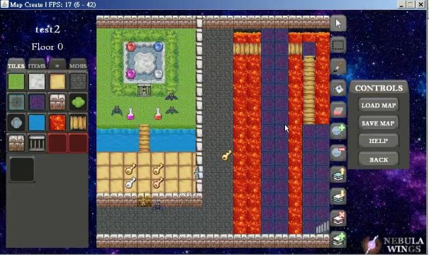

` `––––↑ Version 0.11.1 Interface Update ↑––––

` `\* 24/03/2020 (40):	1	Added Function Key description to several items in RTB.

` `\*		2	Renewed choosing of Map and Game Progress:

` `\*				Now Map have to be chosen before choosing Game Progress: 

` `\*				e.g. map1, ≫map2≪ → New Game, ≫save1≪, save2

` `\*				Instead of (Old Version): e.g. map1, map2, ≫map2-save1≪, map2-save2

` `\*		0,2	Renewed the deletion of Map/Game Progress system so that game players cannot delete the maps.

` `\*		0	Added the function of exiting the selecting screen before entering the actual sub-softwares.

` `\* 25/03/2020 (41):	0	Display Bug on the following fixed:

|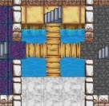|**→**|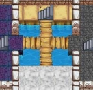|
| :-: | :-: | :-: |

` `\*		0	Allows exiting the selecting screen with the use of mouse.

` `\*		0	Working On: Better Interface (Enclosed Region)

` `\* 26/03/2020 (42):	0	Interface Update

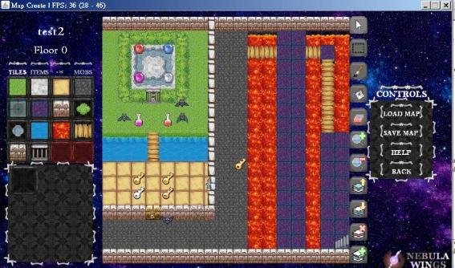

` `\* 28/03/2020 (43):	0	Allows identification of left and right click. They will now perform differently.

` `\* 		0	Display Bug fixed: side texture of floor below a side-oriented wall vertically above water:

|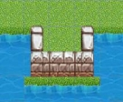|**→**|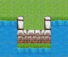|
| :-: | :-: | :-: |

\* 29/03/2020 (44):	0	Display Bug fixed:

|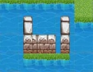|**→**|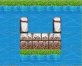|
| :-: | :-: | :-: |

` `\*		0	Corrected names of functions of the code about Left/Right click action of mouse.

` `\*		0	Harshen the contrast of and darken the texture of the buttons of the RTB so that they match the style.

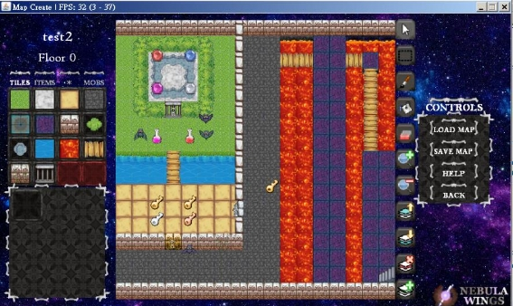

` `\*		o	Can read content from zip files. Lead to more compact and clean file system. 

` `\*		0	Allows skipping of opening animation with mouse click.

` `\*		0	Interface Update

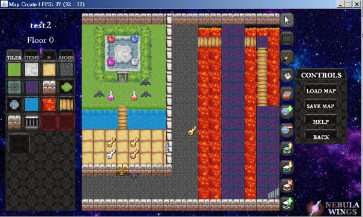

\*		0	Display Bug fixes:

|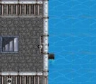|**→**|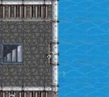|
| :-: | :-: | :-: |

` `\*		0	Bug fixes: The game would not crash anymore when doors are placed as follows:

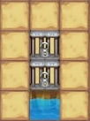

––––↑ Version 0.12.0 Debug and Interface Update ↑––––

` `\*		0	Changed the way data of a SpecialObject / Mob is stored: int -> String

` `\*		\*Format: <tag>content<tag>	P.S. NOT <tag>content</tag> (HTML)

` `\*		e.g. <animate>2<animate> means this object is at its second triggered animation frame.

` `\* 01/04/2020 (45):	0	Added new class of functions, which allows pushing of block. Display Bug related not fixed yet.

` `\* 02/04/2020 (46):	0	Added new layer of tiles [mLowe].

\*		o	Writing of zip file function done.

` `\*		Working on changing all the codes related to I/O of the map / game data to external files, not finished.

` `\* 03/04/2020 (47):	1	Done Zip I/O for MapCreate

` `\*		2	Done Zip I/O for PixelDungeon

` `\*		**Great Simplification of File system↓ (Data of the same map is grouped as a single zip (compressed) file)**
**
` `\*		**And the games can be played and displayed as usual.** 
**
` `\*		**The zip files (.map) are written and read BY the software but not written / compressed manually.**

||**→**||
| :-: | :-: | :-: |

––––↑ Version 0.13.0 Data and Zip Update ↑––––

` `\* 09/04/2020 (48):	1	Allows saving of mStat (stores data of the entities)

` `\*		2	Basic fighting system done (Can hurt each other, no animations / HP bar yet)

` `\* 10/04/2020 (49):	2	Simplified code related to fighting system.

` `\*		2	Now the character will continue fighting until one side dies.

` `\*		2	Bug fix on saveing game progress as “default”.

` `\*		0	HP Bar done (below is a fighting scene, where some HP is deducted from the grey bat)

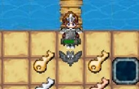

` `\* 11/04/2020 (50):	0	HP Bar edited (x2)

`	`**Note: The scale of the HP bar depends on the zooming size, but it is convenient for doing comparason.**

|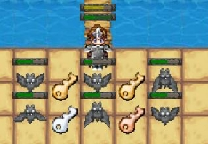|**→**|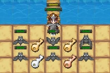|
| -: | :-: | :-: |

––––↑ Version 0.14.0 Fighting Update (I) ↑––––

` `\*		o	Zip: can now read zip file in a zipped file [More than 1 layer].

` `\*		o	Zip: can now read image file in zipped file.

` `\*		o	Zip: now rearranged directories such that the images and the texturedata files are in the same zip file  			 (.tex), andall the .tex (texture) files are in the same zip file (.zip)

|
11/04/2020

|**→**|16/04/2020|
| :-: | :-: | :-: |

` `\* 		o	The above change (rearranging of directories) is cancelled due to inconvenience during debugging.

` `\* 16/04/2020 (51)	o	The above change (rearranging of directories) is redone with modification.

––––↑ Version 0.15.0 Zip Update (II) / Texture Pack Update (I) ↑––––

` `\*	1	Display bug fixed:

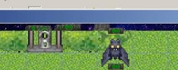

` `\* 18/04/2020 (52)	o	DataArrays class, which is the fundamental part of the displaying of words on screen, is done

` `\* 19/04/2020 (53)	1	The change in hp is shown in red now:

`		`From the diagram below, we can see that the length of the red bar of the player is longer, thus shows that the 			damage caused by the MOB (the bat) is higher than the damage from the player on the MOB.

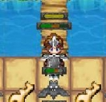

` `\*		0	Added command system related to the display of words (to show the deduction of hp).

` `\* 		0	Simplified code related to the mapping of coordinates from [tile coordinate] to [screen coordinate].

` `\*		0	Added display of deduction of hp: [Font: Cooper Black], will move upward then fade out.

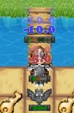

` `\* 20/04/2020 (54)	o	Simplified code related to writing of zip file, enhances the saving speed of maps / game progresses.

` `\*		0	Modified code related to HP bars, now the scale of the HP bar does not depend on the zooming size.

` `\* 21/04/2020 (55)	0	BUG testing, bug discovered but not fixed: Walking pass wall, Not able to start the game

|Walking pass wall||
| :-: | :- |
|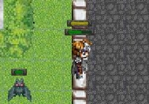|
In a scenario below:

x represents a non–passable obstacle,

? represents an arbitory block/tile,

o represents the player and

\_ represents a empty space

? ? ? ?

**o** 1 2 x

? ? ? ?

when the character walk straightly continuously through the two underlined tiles ( \_ ) in above diagram, then release the key when the character is at halfway between 1 and 2. 
|
|Not able to start the software||
|||

` `\* 22/04/2020 (56)	2	Added “use item” button in the left description column in BAGs tab. 

`			`Only items that have commandOnUsecould be used. 

`				`e.g.“key” items cannot be used while “potion”s can be used. 

`			`Still no execution of commands yet.

` `\*		0	Added yellowish hp bar, representing the addition of HP.

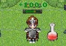

` `\*		2	Added commands for changing attributes of the player (e.g. hp, attack, defense, etc.)

` `\*		1	Bug fix on saving of maps. 

`				`[Bug due to attempting to save the game progress which might not exist yet]

––––↑ Version 0.16.0 Fighting Update (II) / Item and Words Update↑––––

` `\* 24/04/2020 (57)	0,1	Renewed system of drawing [specialobjects], allowing a larger dimension to the special objects.

` `\*		o	Added NPC (Non–player character) *The Wise Elderly* and *Merchant* into game. No functionality yet.

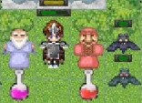

` `\* 25/04/2020 (58)	o	Finished border image for NPC dialogues.

` `\* 		0	Can display a dialogue box.

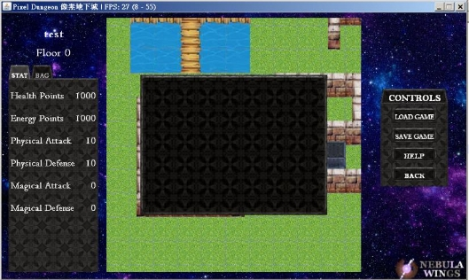

` `\*		0	If–then–else command control structure completed. Also allows nested if–then–else commands.

**I am currently learning on free online lectures about computer programming in Havard University!**

[**https://online-learning.harvard.edu/catalog/free**](https://online-learning.harvard.edu/catalog/free)

**(I am currently learning the *CS50’s Introduction to Game Development*)**

**Hope that these resources would be useful to you too!**

**If you are also interested in this field, and you wish to learn more, fill free to join it!**

**(I know this website yesterday (24/04/2020) and I found it beneficial)**

` `\* 26/04/2020 (59)	0	The game is paused (walking / interaction with NPCs is disabled) when dialogue is on-screen.

` `\*		2	Bug on the change in moving direction of the pushed boxes fixed.

` `\*		1,2	Now interacting with NPCs would trigger dialogue. Content of it is determined by the input when  				the NPC isplaced on the tile. Below is an illustration of how it is done:

`		`The first image is the input dialogue, the second is when the NPC (Merchant) is placed down after the input.

`		`The third image is the dialogue that pop up when the player interact with the NPC.

`		`\*Note that “**/**” (slash) means next line in my softwares if it is adjacent to no other characters but a whitespace.

`		`Still no buttons yet. Cannot close the dialogue yet.

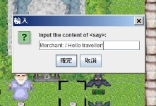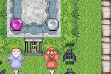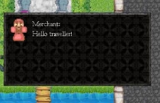

` `\*		2	Working on displaying a table on the input panel.

` `\*		1,2	Buttons will now appear in dialogues, as set when the NPC is placed, and after the first image above.

`			`Commands triggered by the interaction with the buttons are not done yet.

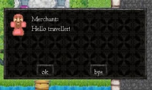

` `\* 27/04/2020 (60)	0,2	Working on alignment of buttons / Adjustable size of buttons

` `\* 01/05/2020 (61)	0,1,2	Completed alignment of buttons, and adjustable size of buttons according to the contents.

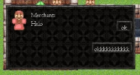

` `\*		1	Bug fixes on not deleting the items on that tile when another object is put on a tile.

|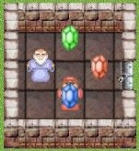|**→**|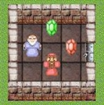|
| :-: | :-: | :-: |

` `\*		1	Bug fixes on not deleting the data stored in the sprites when the sprite is deleted 
`			`[because the data and the sprites are both tile–dependent currently].

` `\*		1,2	Completed NPC dialogue system, including the reaction of command for clicking buttons.

––––↑ Version 0.17.0 NPC Update↑––––

18/5/2021 (62)	/	Setting up *Android Studio* on new computer

19/5/2021 (63)	/	Simplifying code in DISPLAY class, separated FPS calculation onto separate FPS class.

21/5/2021 (64)	/	FPS, Engine, Java Heap Size (lang.OverflowError) fix

22/5/2021 (65)	/	ARRAY class code tidying

`	`0	Debug: Cannot place prison door (Reason: An undefined in-command is called, cannot end properly)

`	`0	Debug: Left Tool Bar of MapCreate debugged

`	`0	Changed *selectTile()* appearance

|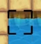|**→**|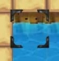|
| :-: | :-: | :-: |

`	`0/1	BUG fix: display problem of *stair* and *wise old man* (2-block high sprite)

23/5/2021 (66)	0	command “*setlist*”: can now select special region

`	`0	command “setlist”, syntax: setlist(r(*variable name, called later*), mobs(*target class*), description) completed. 24/5/2021 (67)	1	command “*nomob*” in Dungeon completed

`	`0/1	prison door: command “setlist”:“nomob” completed

25/5/2021 (68)	1	error during pushing object fixed. (fixed by adding new code: command execution return 2: breaking execution)

26/5/2021 (69)	Added RAM from 8GB to 16GB (2 x 8GB), usable memory increased from 0.6 - 1.3GB to 9.0GB. 

`	`(system memory usage ~5.3GB)
`	`(Prevented crash due to OutOfMemory: cannot allocate memory of 1130000K to Java Virtual Machine)

27/5/2021 (70)	1	player now actually follow the pushed tile, creating the visual effect of pushing the tile

28/5/2021 (71)	1	fixed visual bug due to order of printing of different class of objects.

|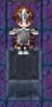|**→**|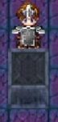|
| :-: | :-: | :-: |

––––↑ Version 0.18.0↑––––

29/5/2021 (72)	0	added command list, as an aid to users to input the commands to merchant after user’s response.

30/5/2021 (73)	0	continued command aid interface in *setcontenttable* menu

01/6/2021 (74)	0	continued command aid interface: syntax warnings are given:

06/5/2021 (75)	0	continued .. *setcontenttable* menu fixed so that the NPC will not be placed if *cancel / X* button is clicked.

25 - 28/5/2021 (76 - 79) *setcontenttable* syntax warnings:

17/8/2021 (80)	2	Passing-through-wall glitch fixed.

19/8/2021 (81)	1	*setcontenttable* menu syntax completed. Now it can assist users even with no programming basis or no concept on names of items in the game to complete commands.

20/8/2021 (82)	2	Done dialogue with NPCs, including chest loots.

14/10/2021 (83-86)	2	Modified character outlook

`	`2	Fixed repeated animation and triggering bug.

`	`2	Done open chest animation

15/10/2021 (87)	2	Fixed bug for not able to retrigger after failure in triggering object. 
(i.e. cannot open door with key if we did not have a key to open the door when we first attempted to open it.)

`		`2	Implemented notification system. Fixed several bugs on the new notification system.

––––↑ Version 0.19.0↑––––

16/10/2021 (88)	2	Audio added into the game. Only audio for tiles are implemented.

3/11/2021 (89)	2	Audio for walking finished.

4/11/2021 (90)	2	Fixed bugs: 

`				`Staircase can only be used once; 

`				`Pushed box glitches and may crash the game

9/11/2021 (91)	2	Allows map creaters to import their own texture pack (.zip)

`		`2	Fixed bugs: Cannot store certain items due to (ID + Encryption code > 127 = MAX\_BYTE)

`		`1,2	Making new texture pack

10/11/2021 (92)	1,2	Making new texture pack "ghost.zip"

`		`1,2	Added brightness system

11/11/2021 (93)	2	Fixed bug: Chinese text displayed without text wrapping.

`		`2	Fighting animation added

`		`2	Show dead message when hp <= 0

`		`**CUHK ENGINEERING JYUNHING (Project Display)**

`		`1,2	Texture Pack

`		`2	Fixed bug: [Braid Girl] character: animate() will play endlessly if followed by say().

`		`1,2	Added feature: can use RELATIVE POSITION to refer to a tile.

12/11/2021 (94)	2	Fixed bug: Player keeps attacking even when he left the mob.

`		`2	Fixed bug: Cannot activate "say" inside "activate()"

`		`2	Fixed bug: Cannot activate function when it contains negative sign "-"

`		`1,2	Finishes dialogue display with user-defined icon.

`		`2	You can now escape in the middle of a fight.

`		`2	Added notification when health is low, cannot inflict any harm on enemy, equipped with item, etc.

`		`2	Added feature that one can equip with items (use on touch) directly if the item allows.

Coming soon: Particle Effects, Special Effects (e.g. Poisoned II, Power III)

TODO: 	Background when win, Texture Pack packaging utility (Double Zipping), figure out the use of JprogressBar

`	`Stat-controlled *setlist* in MapCreate

`	`Better user instructions //done using signs

TODO Later: 	Progress bar when saving map…, 
Special Effects (e.g. poison 4, power 3, weakness 1), 
Particle effects, 

BUGs Found: 	Game lags sometimes

Game Plan:	NPCs, mobs are not going to stay still, they could move and be active instead of passive

`	`Player can move diagonally as long as there is no obstacle in that direction (takes 2 amount of time to arrive)

`	`Boss fight

`	`Increase speed of player

`	`Allow speeding up and slowing down modes

`	`Display health as health bar in left column

`	`Projectiles from player and mobs

`	`Throwing objects (and discarding objects)

`	`Maximum bag size

`	`A\* path finding (whenever user clicks a spot that the player can reach, it pathfinds there (has limit in range, say 7 x 7)

`	`Allow multiple paths of story

`	`Allow importing different texture-and-action packs for different stories.

`	`Game end animation for player's death

`	`Opening scene for new game (add new object: notice board / sign)

